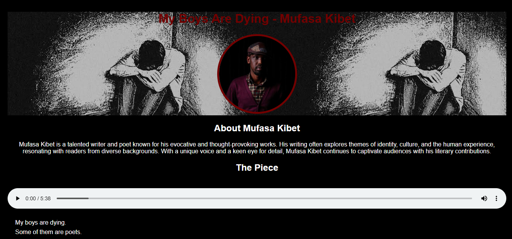

# My Boys Are Dying



## Overview

**My Boys Are Dying** is a beginner-friendly HTML and CSS project inspired by the spoken word poem by **Mufasa Kibet**.

The project presents the poem alongside an embedded HTML5 audio player, creating a simple and immersive reading experience while helping beginners practice semantic HTML, typography, page structure, and basic CSS styling.

---

## Features

- Semantic HTML5 structure
- Responsive webpage layout
- HTML5 audio player
- Embedded images
- Clean typography
- Dark minimalist theme
- Beginner-friendly codebase

---

## Technical Stack

- **Markup:** HTML5
- **Styling:** CSS3
- **Audio:** HTML5 `<audio>` Element
- **Deployment:** GitHub Pages

---

# Quick Start & Installation Guide

## Prerequisites

All you need is:

- A modern web browser
- A code editor (VS Code, Cursor, WebStorm, Sublime Text, etc.)

---

## Local Development

### 1. Clone the repository

```bash
git clone https://github.com/aymanissa-dev/my-boys-are-dying.git

cd my-boys-are-dying
```

### 2. Launch the Project

Open `index.html` directly in your browser, or

Use the **Live Server** extension in VS Code or Cursor for automatic hot reloading.

---

## Project Structure

```text
my-boys-are-dying/
├── index.html             # Main HTML document
├── styles.css             # Project styles
├── myboysaredying.mp3     # Spoken word audio
├── screenshot.png         # Project preview
└── README.md              # Project documentation
```

---

## Learning Objectives

This project helps beginners practice:

- Semantic HTML5
- Page structure
- Typography
- Image embedding
- HTML5 audio
- Responsive layouts
- Basic CSS styling

---

## Credits

**Poem:** *My Boys Are Dying*

**Writer & Performer:** Mufasa Kibet

This project was created for educational purposes and frontend development practice. All rights to the original spoken word performance belong to Mufasa Kibet.

---

## License

Created by **Ayman Issa**.

This project is fully open-source and free to use for learning, teaching, and improving HTML & CSS fundamentals.